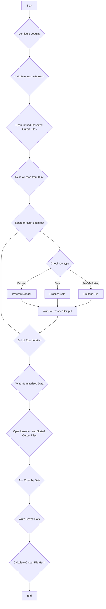
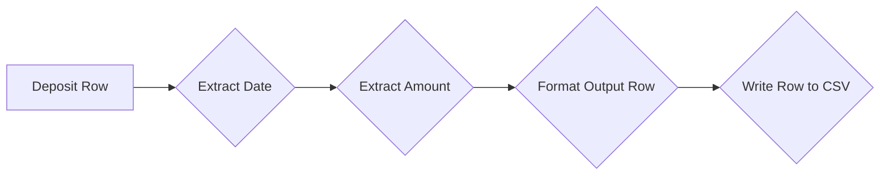
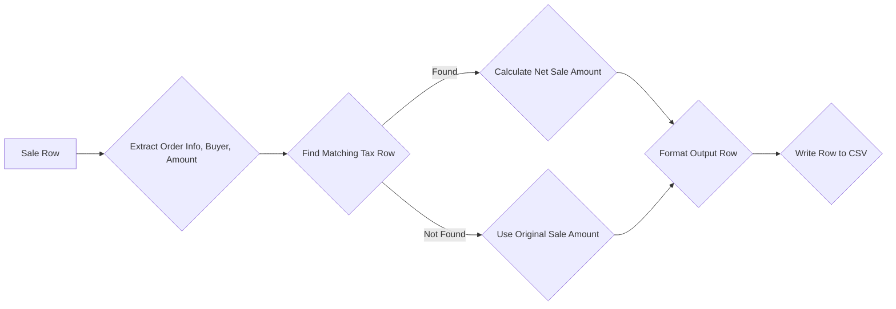
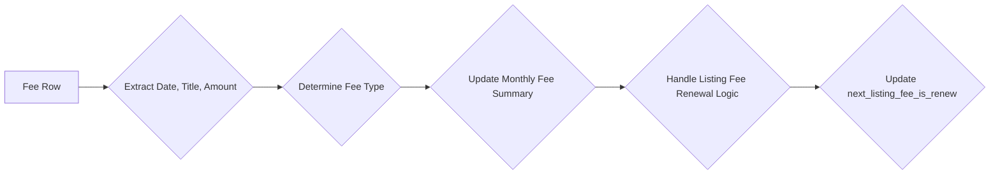

# EtsyCSVtoLexoffice: Etsy-CSV für Lexoffice konvertieren

Dieses Python-Programm konvertiert eine CSV-Datei von Etsy in ein Format, das für den Import in Lexoffice geeignet ist. Es liest die Datei `input.csv` ein, verarbeitet die Daten und schreibt sie in die Datei `output.csv`. Zusätzlich wird eine Log-Datei erstellt, die den Konvertierungsprozess dokumentiert. 

**Wichtiger Hinweis:** Dieses Programm dient nur zu Demonstrationszwecken. Der Autor übernimmt keine Garantie für die steuerliche Richtigkeit der Konvertierung. Es liegt in Ihrer Verantwortung, die konvertierten Daten vor dem Import in Lexoffice zu überprüfen und sicherzustellen, dass sie den aktuellen steuerlichen Vorschriften entsprechen.

## Voraussetzungen

* **Python 3:** Stellen Sie sicher, dass Python 3 auf Ihrem System installiert ist. Sie können Python von [https://python.org](https://python.org) herunterladen.
* **Installierte Pakete:** Sie müssen die Pakete `pandas` und `hashlib` installieren. Führen Sie dazu folgenden Befehl in Ihrer Konsole aus: 
    ```bash
    pip install pandas hashlib
    ```

## Anleitung

1. **CSV-Datei von Etsy herunterladen:** Laden Sie die gewünschte CSV-Datei aus Ihrem Etsy-Shop herunter. 
2. **CSV-Datei umbenennen:** Benennen Sie die heruntergeladene CSV-Datei in `input.csv` um.
3. **Skript herunterladen:** Laden Sie die Datei `etsy_to_lexoffice.py` herunter und speichern Sie sie im gleichen Verzeichnis wie die `input.csv`.
4. **Skript ausführen:** Öffnen Sie Ihre Konsole, navigieren Sie zum Verzeichnis der Dateien und führen Sie das Python-Skript aus.  
    ```bash
    python etsy_to_lexoffice.py 
    ```
    Das Skript erstellt eine neue CSV-Datei namens `output.csv`, die für den Import in Lexoffice bereit ist. Außerdem wird eine Log-Datei erstellt, die detaillierte Informationen über den Konvertierungsprozess enthält.
5. **CSV-Datei in Lexoffice importieren:** Importieren Sie die Datei `output.csv` in Lexoffice.

## Funktionsweise im Detail

Das Programm arbeitet in drei Schritten:

### 1. Einlesen und Vorbereiten der Daten

* **Einlesen der Etsy-CSV:** Das Programm liest die Datei `input.csv` ein. Diese Datei sollte die von Etsy heruntergeladene CSV-Datei sein, die in Schritt 2 umbenannt wurde.
* **Initialisierung:** Es werden Variablen initialisiert, um den aktuellen Monat, die aufgelaufenen Gebühren und andere relevante Daten zu speichern. 

### 2. Verarbeitung der Daten

Das Programm iteriert über jede Zeile der `input.csv` und führt je nach Typ der Zeile unterschiedliche Aktionen aus:

* **Auszahlungen (Deposits):** Auszahlungen von Etsy werden erkannt und die relevanten Daten (Datum, Betrag) extrahiert. Das Datum wird von dem Format "Monat Tag, Jahr" in "Tag.Monat.Jahr" umgewandelt. Der Betrag wird als positiver Wert gespeichert, da es sich um eine Ausgabe handelt, die den Etsy-Verkaufserlös reduziert.
* **Verkäufe (Sales):** Verkäufe werden erkannt und die Daten (Datum, Käufer, Bestellnummer, Betrag) extrahiert. Das Datum wird wie bei den Auszahlungen umgewandelt. Der Betrag wird um eventuelle Steuern (State-Tax) bereinigt, die Etsy direkt einbehalten hat.
* **Gebühren (Fees) und Marketing:** Gebühren und Marketingausgaben werden erkannt und die Daten (Datum, Art der Gebühr, Betrag) extrahiert. Das Datum wird in das gewünschte Format umgewandelt. Der Betrag wird aufsummiert und nach Art der Gebühr gruppiert. 
* **Monatliche Zusammenfassung:** Am Ende jedes Monats werden die aufgelaufenen Gebühren und Marketingausgaben in die `output.csv` geschrieben.

### 3. Schreiben der Daten

* **Erstellen der `output.csv`:** Das Programm erstellt die Datei `output.csv` und schreibt die konvertierten Daten in der richtigen Reihenfolge und im richtigen Format hinein. 
* **Log-Datei:** Parallel zum Konvertierungsprozess wird eine Log-Datei erstellt. Diese Datei enthält detaillierte Informationen über jede verarbeitete Zeile, z.B. den Typ der Zeile, die extrahierten Daten und eventuelle Fehlermeldungen. Die Log-Datei ist hilfreich, um Fehler zu finden und den Konvertierungsprozess nachzuvollziehen.


##  Speichern der Dateien

Nach der Ausführung des Programms finden Sie die folgenden Dateien in dem Verzeichnis, in dem Sie das Skript ausgeführt haben:

* **`input.csv`:** Die von Ihnen bereitgestellte Etsy-CSV-Datei.
* **`output.csv`:** Die für den Import in Lexoffice konvertierte CSV-Datei.
* **`etsy_to_lexoffice.py`:** Das Python-Skript.
* **`convert_csv_[Datum]_[Zeit].log`:** Die Log-Datei mit detaillierten Informationen zum Konvertierungsprozess.

Bewahren Sie diese Dateien an einem sicheren Ort auf, um Ihre Buchhaltungsunterlagen zu vervollständigen und bei Bedarf darauf zugreifen zu können.

## Anpassung

Das Skript kann an Ihre individuellen Bedürfnisse angepasst werden. Sie können z. B. die Art und Weise ändern, wie bestimmte Daten extrahiert oder formatiert werden. Beachten Sie jedoch, dass Änderungen am Code zu unerwünschten Ergebnissen führen können.

## Haftungsausschluss

Dieses Programm wird ohne jegliche Gewährleistung bereitgestellt. Der Autor haftet nicht für Schäden, die durch die Verwendung dieses Programms entstehen.


## Etsy CSV Converter: Detailed Documentation

This document provides a detailed explanation of the Python script designed to convert an Etsy transaction CSV into a structured format suitable for accounting or analysis. 

### 1. Overview

The script takes an input CSV file containing Etsy transaction data (sales, deposits, fees) and transforms it into a more organized CSV output file. The output file presents the data in a chronologically sorted manner, summarizes fees by month and category, and uses a consistent format for dates and amounts. 

### 2. Code Structure and Flow

The script is structured into several functions to improve readability, maintainability, and testability. Here's a breakdown of the main components:

**2.1. Main Function: `convert_csv(input_file, output_file)`**

This function acts as the primary driver of the conversion process.



**2.2. Processing Functions:**

* **`process_deposit(row, writer)`:** Extracts relevant information (date, amount) from a "Deposit" row and writes it to the output CSV in the desired format.



* **`process_sale(row, rows, writer)`:** Processes "Sale" entries, considering associated taxes and fees to calculate the net sale amount. It searches for corresponding "Tax" rows to accurately adjust the sale value.



* **`process_fee(row, data, current_month, writer, next_listing_fee_is_renew)`:** Handles different types of fees (Listing, Transaction, etc.) by categorizing and summarizing them monthly. It accumulates fee data in the `data` dictionary for later output.



**2.3. Helper Functions:**

* **`calculate_file_hash(filepath)`:** Calculates the SHA-256 hash of a given file to ensure data integrity.
* **`get_datetime_filename()`:** Generates a timestamped filename, useful for log files.
* **`configure_logging(filename)`:** Sets up the logging system to write messages to a file for debugging and tracking.
* **`update_fees(data, recipient, fee_type, fees_taxes)`:** Updates the accumulated fee data in the `data` dictionary.
* **`write_summarized_data(data, last_day_of_month, writer)`:** Writes the summarized monthly fee data to the output CSV.

### 3. Data Structures

The script utilizes a few essential data structures:

* **`data` (dictionary):**  Stores summarized fee information. The keys are fee recipients (e.g., "Etsy Ireland UC"), and the values are dictionaries containing fee types (e.g., "Listing Fees") and their corresponding accumulated amounts.
* **`rows` (list):** Holds all rows read from the input CSV file, allowing for efficient searching for related entries (e.g., matching "Sale" rows with their "Tax" counterparts). 

### 4. Example Usage

To run the script, execute the following command, replacing `input.csv` and `output.csv` with your actual file names:

```bash
python etsy_converter.py input.csv output.csv 
```

This will read the data from `input.csv`, process it according to the defined functions, and create a new, formatted CSV file named `output.csv`.

### 5. Error Handling and Logging

The script incorporates error handling using `try-except` blocks to catch potential exceptions during data processing. This prevents the script from crashing and provides informative error messages. 

The `logging` module is used extensively to log key events and potential issues during execution. This information is written to a timestamped log file, aiding in debugging and monitoring the script's behavior.

This documentation provides a comprehensive understanding of the Etsy CSV conversion script. By following the explanations and diagrams, you can easily grasp the code's functionality, data flow, and potential for future enhancements.
